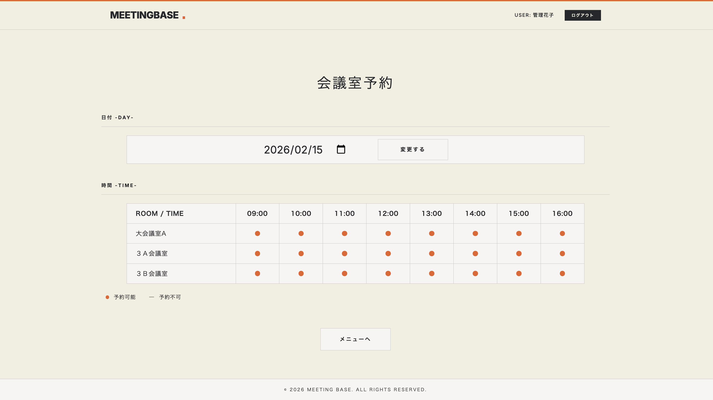
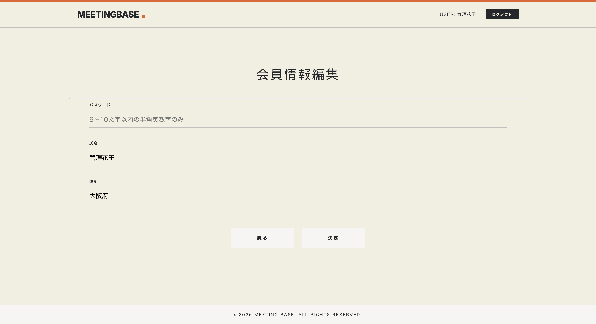
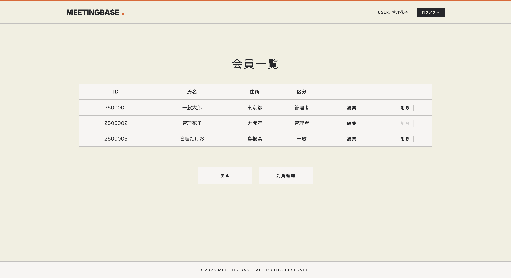

# MeetingBase (社内会議室予約システム)

職業訓練校のチーム開発課題（7名チーム・開発期間20日）として制作。
24時間稼働の自動管理により、「ダブルブッキングの解消」と「管理コストの削減」を実現し、社内業務の効率化を目指したシステムです。

<br>



## 概要
* **目的**: 会議室予約のデジタル化により、予約状況の可視化と管理業務の自動化を行う。
* **機能**: ユーザー認証、会議室予約、予約キャンセル、会員管理・会議室管理など。
<br>

## 技術スタック
* **言語**: Java 17
* **データベース**: MySQL
* **フロントエンド**: CSS
* **環境**: Eclipse
* **バージョン管理**: Git / GitHub
<br>

## 開発体制
* **開発期間**: 20日間（2026年1月6日 ～ 1月27日）
* **チーム構成**: 7名
* **私の役割**: PL / バックエンド開発 / CSS設計・実装
<br>

## ドキュメント
ドキュメント一式を公開しています。

| 資料名 |
| :--- |
| [JavaDoc](https://hasebe1984.github.io/MeetingBase/) |
| [要件定義書](./docs/requirements.pdf) |
| [WBS](./docs/wbs.pdf) |
| [DB設計書](./docs/db_schema.pdf) |
| [画面遷移図](./docs/screen_transition.pdf) |
| [テスト仕様書](./docs/test_cases.pdf) |
| [不具合管理表](./docs/bug_report.pdf) |
| [プロジェクト完了報告書](./docs/project_report.pdf) |

## 担当領域と実装詳細

私はプロジェクトリーダーとして全体の進捗を管理しつつ、主に「管理者向け機能」と「アプリケーション全体のデザイン」を担当しました。
<br>
<br>

### 1. 管理者機能の実装
管理者向けページのjspとサーブレットを担当しました。
<br>

| ファイル | 実装内容・こだわり |
| :--- | :--- |
| **`AdminUserServlet.java`** | **会員管理**<br>全ユーザーの権限変更・削除を制御。ログイン中の自分自身を削除できないようにするガード機能を実装し、安全性を高めました。 |
| **`RoomEditServlet.java`** | **会議室マスタ管理**<br>新規登録と編集のJSPを共通化し、サーブレット側でモードを切り替えて処理することで、コードの重複を排除し保守性を向上させました。 |
| **`UserEditServlet.java`** | **厳格なバリデーション**<br>DB整合性とセキュリティを担保するため、入力値のチェックを徹底しました。 |
| **`Filter` (AuthFilter)** | **アクセス制御の一元化**<br>未ログイン者がURLへ直接アクセスするのを防止するセキュリティ制御を実装しました。 |
<br>

### 2. CSS設計・UI実装 (独自実装)
* **ベーススタイルの構築 (`style.css`)**:
    * **モダンデザイン**: ベージュ、黒、オレンジを基調とした洗練されたトーン＆マナーを採用。
    * **ユニバーサルデザイン**: 色覚の多様性に配慮し、コントラスト比を調整。誰でも視認しやすい設計にしました。
<br>

## 担当したページのハイライト

| 会員情報編集画面 | 会員一覧（管理者） |
| :---: | :---: |
|  |  |
<br>

## 直面した課題と解決策

### PLとしてのタスク配分とリソースの最適化
**課題:**
チーム開発中、特定のメンバーに負荷が集中する一方で、開発が早く終わったメンバーの手が空いてしまう「リソースの偏り」が発生しました。
<br>

**解決策と学び:**
1. **動的なタスクの再割り当て**:
    * WBSを日次で更新し、進捗に余裕があるメンバーには早期のテスト実施、ドキュメント作成、他メンバーのサポート等を依頼しました。
2. **チーム全体の生産性向上**:
    * 役割を固定しすぎず、状況に応じて「今チームに足りない仕事」を柔軟に配分し続けることで、20日間という限られた期間内で全機能を高い品質で完成させることができました。
<br>

## ディレクトリ構成
```text
root
├── src/main/java/jp/co/sys/
│    ├── bean/           # データモデル (MeetingRoom, UserBean 等)
│    ├── dao/            # DBアクセスロジック (UserDao 等)
│    ├── servlet/        # ★担当箇所：コントローラー (UserEdit, AdminUser 等)
│    └── util/           # ★担当箇所：共通クラス (RoomList, DatabaseConfig 等)
├── src/main/webapp/
│    ├── common/         # ★担当箇所：ヘッダー・フッター共通部品
│    ├── css/            # ★担当箇所：style.css (全体デザイン)
│    ├── images/         # ロゴ・スクリーンショット
│    └── jsp/            # ★担当箇所：UI (userList.jsp, reserveInput.jsp 等)
└── docs/                # ★担当箇所：要件定義書・不具合管理表等の設計資料一式
